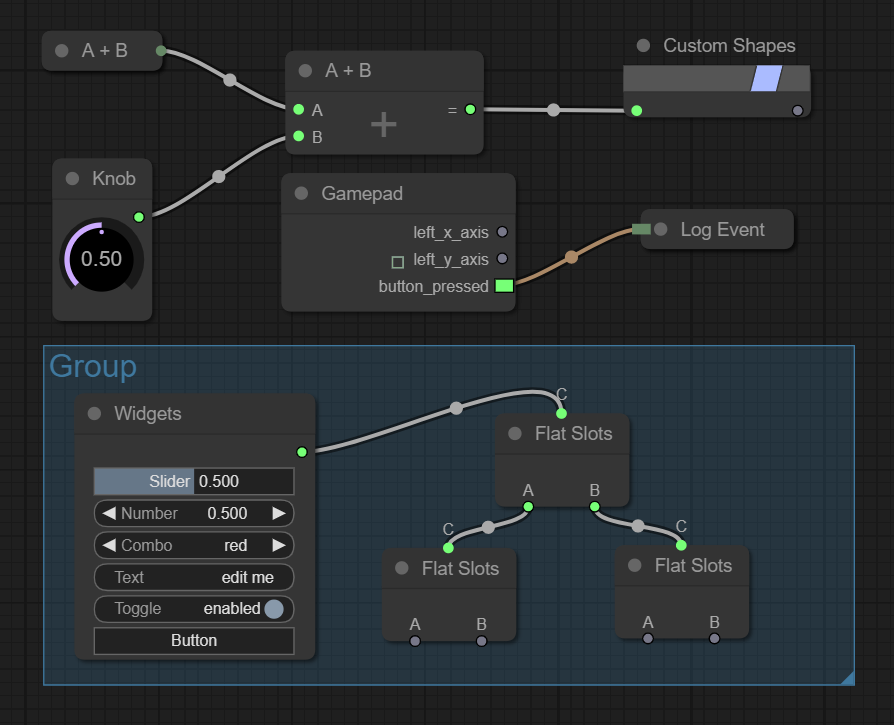

# @ComfyOrg/litegraph

This is the litegraph version used in [ComfyUI_frontend](https://github.com/Comfy-Org/ComfyUI_frontend).

It is a fork of the original `litegraph.js`. Some APIs may by unchanged, however it is largely incompatible with the original.

Some early highlights:

- Accumulated comfyUI custom changes (2024-01 ~ 2024-05) (https://github.com/Comfy-Org/litegraph.js/pull/1)
- Type schema change for ComfyUI_frontend TS migration (https://github.com/Comfy-Org/litegraph.js/pull/3)
- Zoom fix (https://github.com/Comfy-Org/litegraph.js/pull/7)
- Emit search box triggering custom events (<https://github.com/Comfy-Org/litegraph.js/pull/10>)
- Truncate overflowing combo widget text (<https://github.com/Comfy-Org/litegraph.js/pull/17>)
- Sort node based on ID on graph serialization (<https://github.com/Comfy-Org/litegraph.js/pull/21>)
- Fix empty input not used when connecting links (<https://github.com/Comfy-Org/litegraph.js/pull/24>)
- Batch output connection move/disconnect (<https://github.com/Comfy-Org/litegraph.js/pull/39>)
- And now with hundreds more...

# Usage

This library is included as a git subtree in the ComfyUI frontend project at `src/lib/litegraph`.

# litegraph.js

A TypeScript library to create graphs in the browser similar to Unreal Blueprints.

<details>

<summary>Description of the original litegraph.js</summary>

A library in Javascript to create graphs in the browser similar to Unreal Blueprints. Nodes can be programmed easily and it includes an editor to construct and tests the graphs.

It can be integrated easily in any existing web applications and graphs can be run without the need of the editor.

</details>



## Features

- Renders on Canvas2D (zoom in/out and panning, easy to render complex interfaces, can be used inside a WebGLTexture)
- Easy to use editor (searchbox, keyboard shortcuts, multiple selection, context menu, ...)
- Optimized to support hundreds of nodes per graph (on editor but also on execution)
- Customizable theme (colors, shapes, background)
- Callbacks to personalize every action/drawing/event of nodes
- Graphs can be executed in NodeJS
- Highly customizable nodes (color, shape, widgets, custom rendering)
- Easy to integrate in any JS application (one single file, no dependencies)
- Typescript support

## Integration

This library is integrated as a git subtree in the ComfyUI frontend project. To use it in your code:

```typescript
import { LGraph, LGraphNode, LiteGraph } from '@/lib/litegraph'
```

## How to code a new Node type

Here is an example of how to build a node that sums two inputs:

```ts
import { LiteGraph, LGraphNode } from "./litegraph"

class MyAddNode extends LGraphNode {
  // Name to show
  title = "Sum"

  constructor() {
    this.addInput("A", "number")
    this.addInput("B", "number")
    this.addOutput("A+B", "number")
    this.properties.precision = 1
  }

  // Function to call when the node is executed
  onExecute() {
    var A = this.getInputData(0)
    if (A === undefined) A = 0
    var B = this.getInputData(1)
    if (B === undefined) B = 0
    this.setOutputData(0, A + B)
  }
}

// Register the node type
LiteGraph.registerNodeType("basic/sum", MyAddNode)
```

## Server side

It also works server-side using NodeJS although some nodes do not work in server (audio, graphics, input, etc).

```ts
import { LiteGraph, LGraph } from "./litegraph.js"

const graph = new LGraph()

const firstNode = LiteGraph.createNode("basic/sum")
graph.add(firstNode)

const secondNode = LiteGraph.createNode("basic/sum")
graph.add(secondNode)

firstNode.connect(0, secondNode, 1)

graph.start()
```

## Projects using it

### [ComfyUI](https://github.com/comfyanonymous/ComfyUI)


### Projects using the original litegraph.js

<details>

<summary>Click to expand</summary>

### [webglstudio.org](http://webglstudio.org)


### [MOI Elephant](http://moiscript.weebly.com/elephant-systegraveme-nodal.html)


### Mynodes


</details>

## Feedback

Please [open an issue](https://github.com/Comfy-Org/litegraph.js/issues/) on the GitHub repo.

# Development

Litegraph has no runtime dependencies. The build tooling has been tested on Node.JS 20.18.x

## Releasing

Use GitHub actions to release normal versions.

1. Run the `Release a New Version` action, selecting the version incrment type
1. Merge the resultion PR
1. A GitHub release is automatically published on merge

### Pre-release

The action directly translates `Version increment type` to the npm version command. `Pre-release ID (suffix)` is the option for the `--preid` argument.

e.g. Use `prerelease` increment type to automatically bump the patch version and create a pre-release version. Subsequent runs of prerelease will update the prerelease version only.
Use `patch` when ready to remove the pre-release suffix.

## Contributors

You can find the [current list of contributors](https://github.com/Comfy-Org/litegraph.js/graphs/contributors) on GitHub.

### Contributors (pre-fork)

- atlasan
- kriffe
- rappestad
- InventivetalentDev
- NateScarlet
- coderofsalvation
- ilyabesk
- gausszhou
